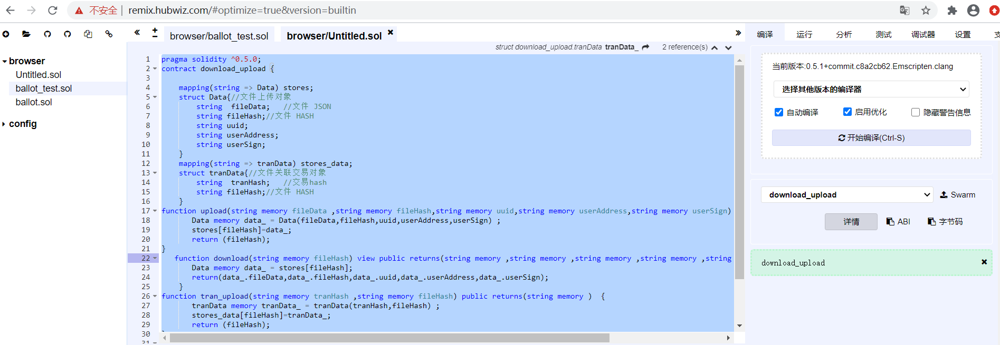
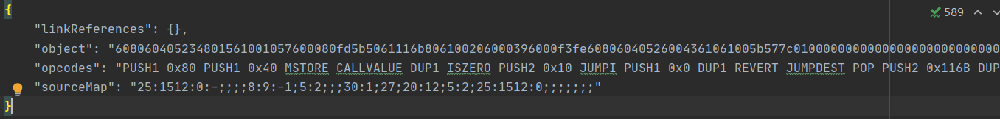

## 存证合约
#### solidity合约（0.4.18）
##### solidity合约编写
1. 构建类及映射类型
```
uint CODE_SUCCESS = 3002;
    uint DATA_FAIL=3001;
    struct  Data{
        string  fileData;   //文件 JSON
        bytes fileHash;//文件 HASH
        string uuid;
        string userAddress;
        string userSign;
    }
    mapping(bytes => Data) datamap;
     mapping(bytes => tranData) stores_data;
    struct tranData{//文件关联交易对象
        string  tranHash;   //交易hash
        bytes fileHash;//文件 HASH
    }
```
2. 数据存储
```
   function upload(string  fileData ,bytes fileHash,string uuid,string userAddress,string  userSign) returns(uint code){
        Data storage data = datamap[fileHash];
           if(data.fileHash.length != 0){
            return DATA_FAIL;
        }
        data.fileHash = fileHash;
        data.fileData = fileData;
        data.uuid = uuid;
        data.userAddress = userAddress;
        data.userSign= userSign;
        return CODE_SUCCESS;
}
```
3. 数据查询
```
 function download(bytes fileHash)  returns(string ,bytes  ,string  ,string  ,string  ){
       Data storage data = datamap[fileHash];
       return(data.fileData,data.fileHash,data.uuid,data.userAddress,data.userSign);
    }
```
4. 交易存储
```
 function tran_upload(string  tranHash ,bytes fileHash) returns(uint code){
        tranData storage trandata = stores_data[fileHash];
        trandata.fileHash = fileHash;
        trandata.tranHash = tranHash;
        return CODE_SUCCESS;
}
```
5. 交易查询
```
 function tran_download(bytes fileHash)  returns(string ,bytes ){
      tranData storage trandata = stores_data[fileHash];
       return(trandata.tranHash,trandata.fileHash);
    }
```
##### 合约编译

1. 本项目基于在线编译-https://remix.ethereum.org/（需翻墙）
    

2. 复制字节码到contracts/evidence.bin  
    - 注意只复制object
    
3. 复制abi到contracts/evidence.abi 

