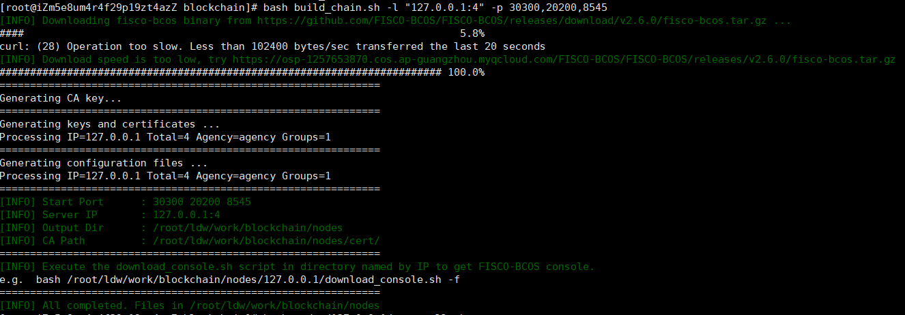
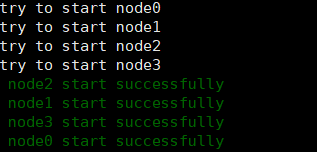
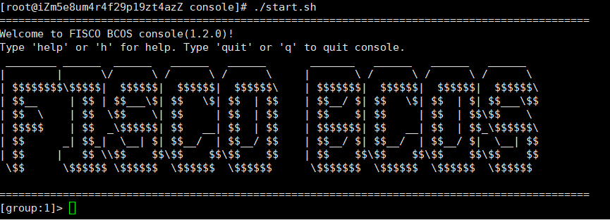

## fisco bcos环境安装
##### fisco bcos单链安装
1. 下载build_chain.sh脚本
```
curl -#LO https://gitee.com/FISCO-BCOS/FISCO-BCOS/raw/master/tools/build_chain.sh && chmod u+x build_chain.sh
```
2. 搭建联盟链(远程需修改ip)
```
bash build_chain.sh -l "127.0.0.1:4" -p 30300,20200,8545
```

3. 启动联盟链
```
bash nodes/127.0.0.1/start_all.sh
```


##### fisco bcos 控制台安装

4. 下载执行配置脚本
```
curl -#LO https://gitee.com/FISCO-BCOS/console/raw/master/tools/download_console.sh
./download_console.sh
```
5. 复制配置文件
```
cp -n console/conf/applicationContext-sample.xml console/conf/applicationContext.xml
```
6. 拷贝控制台证书
```
cp nodes/127.0.0.1/sdk/* console/conf/
```
7. 拷贝控制台证书
```
./start.sh
```


##### 远程连接

8. 放通防火墙及安全组
```
firewall-cmd --zone=public --add-port=8545/tcp --permanent
firewall-cmd --zone=public --add-port=20200/tcp --permanent
firewall-cmd --reload
```