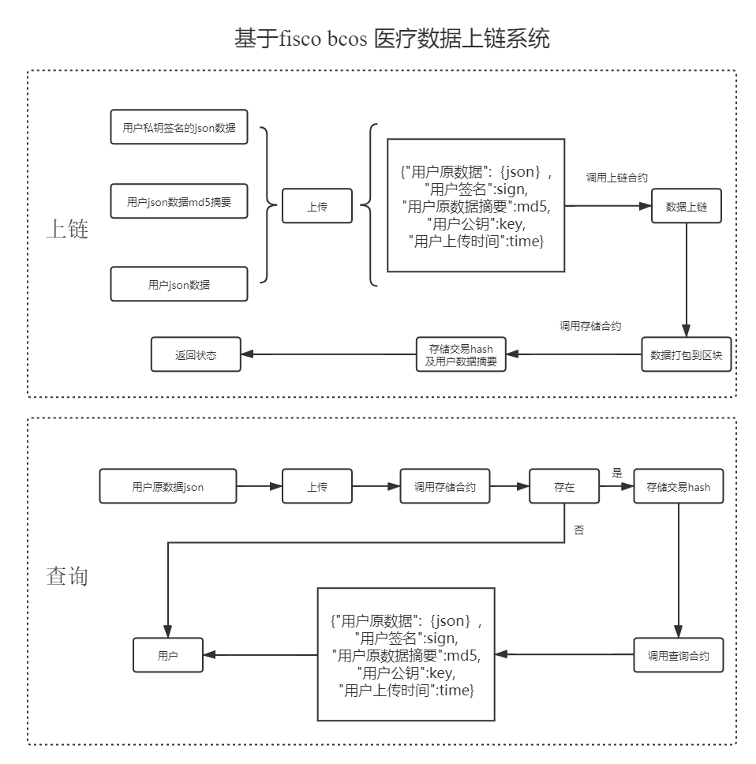
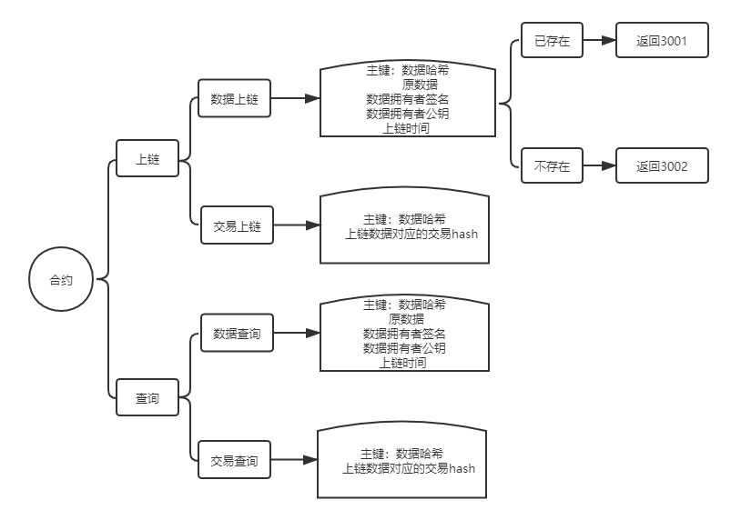
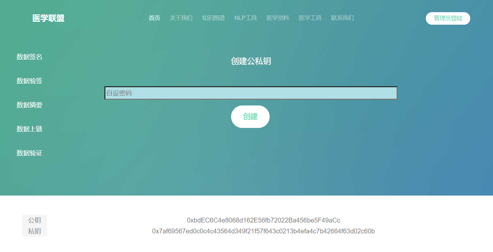
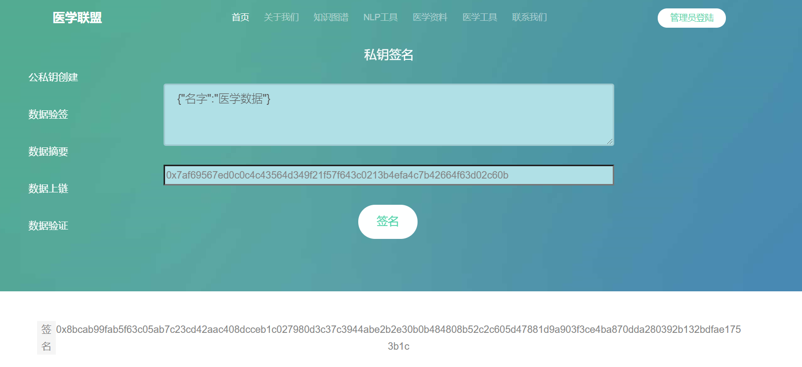
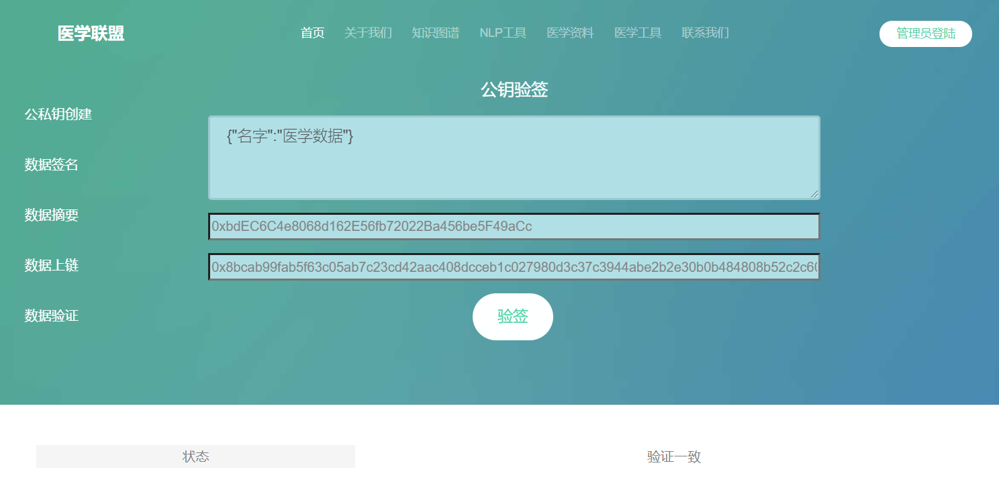
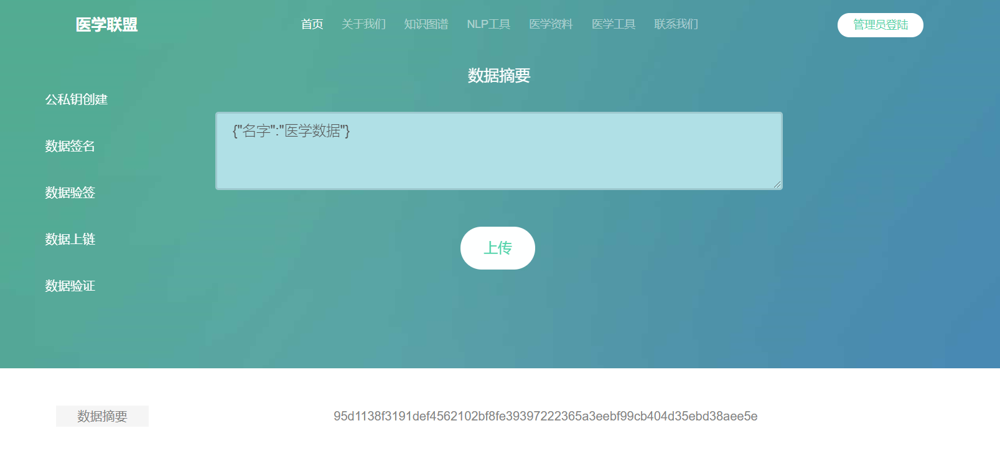
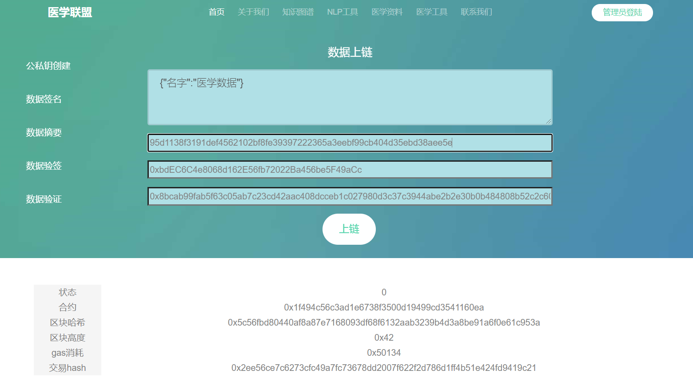
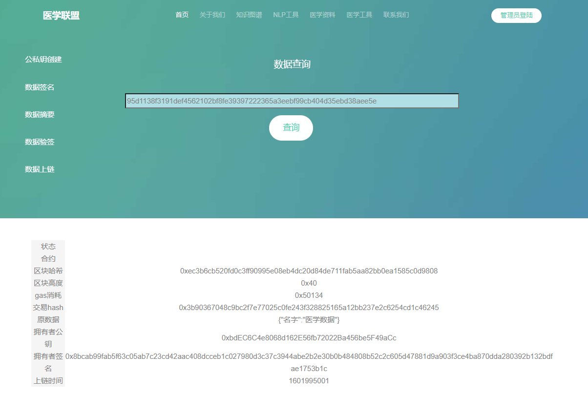

# 医学区块链

#### 介绍
基于区块链存储医学知识（简单模型）
- 区块链公私钥生成
- 区块链私钥签名
- 区块链公钥验签
- 区块链哈希摘要
- 区块链数据上链
- 区块链数据验证
- 区块链浏览器
#### 软件架构（基于fisco bcos）
 版本：2.60  
 参考 ：https://fisco-bcos-documentation.readthedocs.io/
#### 使用说明
 1. [fisco—bcos部署参考](./docs/fiscoBcos.MD)
 2. 安装python  
 3. [fisco—bcos python sdk 安装参考](./docs/sdk.MD)
 4. 执行 python ficso_bcos_before.py  
 5. 将结果copy到client_config.py中的contract_address 
#### 系统架构

#### 合约设计
[存证合约详情](./docs/contract.MD)    

  
#### sdk调用说明
##### 数据上链
【请求路径】http://0.0.0.0:5081/api/p/medical/blockchain/upload  
【请求消息】
```
{
    "file_hash": 数据哈希
    "file_data": 原数据,
    "file_pubkey": 公钥,
    "file_sign": 签名,
    "file_time": 时间戳,
  }


```
【应答消息】
```
如果数据hash已经存在，返回：
{
    'error': '数据存在'
}
如果数据hash不存在，返回：
{   
    'blockHash': '0x9d4afaa7318d0a099bc74427cbe80527494b5e1c22500ef74d921f35bc77627d', 
    'blockNumber': '0x11', 
    'gasUsed': '0x201d2', 
    'transactionHash': '0x80e2012e09e23aaa13df60add72cdf74b501a6a999060803d4e3c84360b69d8d', 
    'contractname': '0x1f494c56c3ad1e6738f3500d19499cd3541160ea', 
    'error': '0'
}

```
##### 数据查询
【请求路径】http://0.0.0.0:5081/api/p/medical/blockchain/download  
【请求消息】
```
{
    "file_hash": 数据哈希
  }


```
【应答消息】
```
如果数据hash不存在，返回：
{
    'error': '数据不存在'
}
如果数据hash存在，返回：
{
    "file_hash": 数据哈希
    "file_data": 原数据,
    "file_pubkey": 公钥,
    "file_sign": 签名,
    "file_time": 时间戳, 
    'blockHash': '0x9d4afaa7318d0a099bc74427cbe80527494b5e1c22500ef74d921f35bc77627d',
    'blockNumber': '0x11', 
    'contractAddress': '0x1f494c56c3ad1e6738f3500d19499cd3541160ea',
    'gasUsed': '0x201d2', 
    'transactionHash': '0x80e2012e09e23aaa13df60add72cdf74b501a6a999060803d4e3c84360b69d8d', 
    'transactionIndex': '0x0'
}
```
##### 区块链公私钥生成
【请求路径】http://0.0.0.0:5081/api/p/medical/blockchain/crate  
【请求消息】
```
{
    "key": 用户自行设定密码
 }
```
【应答消息】
```
{
    'prvkey': '私钥'
    'address':地址，
}

```
##### 区块链私钥签名
【请求路径】http://0.0.0.0:5081/api/p/medical/blockchain/sign  
【请求消息】
```
{
    "prvkey": 私钥
    "text":字符串
 }
```
【应答消息】
```
如果私钥正确
{
    'sign': '签名'
}
不正确
{
    "error": '私钥格式不对'
}
```
##### 区块链公钥验签
【请求路径】http://0.0.0.0:5081/api/p/medical/blockchain/verify  
【请求消息】
```
{
    "sign": 签名
    "text":字符串
    "address":地址
 }
```
【应答消息】
```
如果公钥、签名格式正确
{
    "status": '验证失败'/'验证一致'
}
不正确
{
    "status": '格式错误'
}
```

##### 区块链数据摘要
【请求路径】http://0.0.0.0:5081/api/p/medical/blockchain/hash  
【请求消息】
```
{
    "text":字符串
 }
```
【应答消息】
```
{
    "hash": 数据摘要
}

```
#### 页面展示
[页面地址](https://gitee.com/medical-alliance/medical-blockchain)












